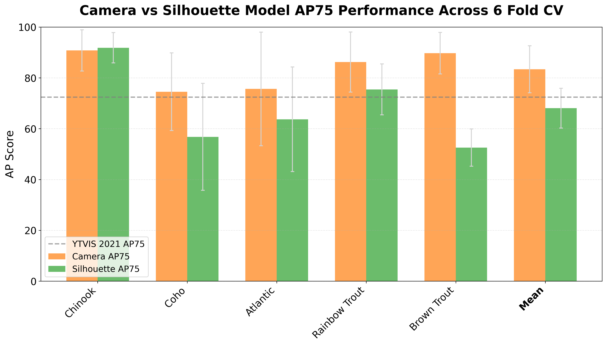
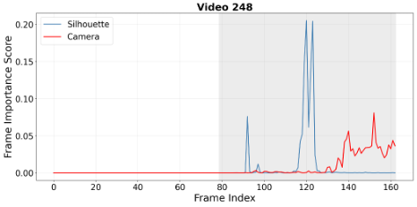
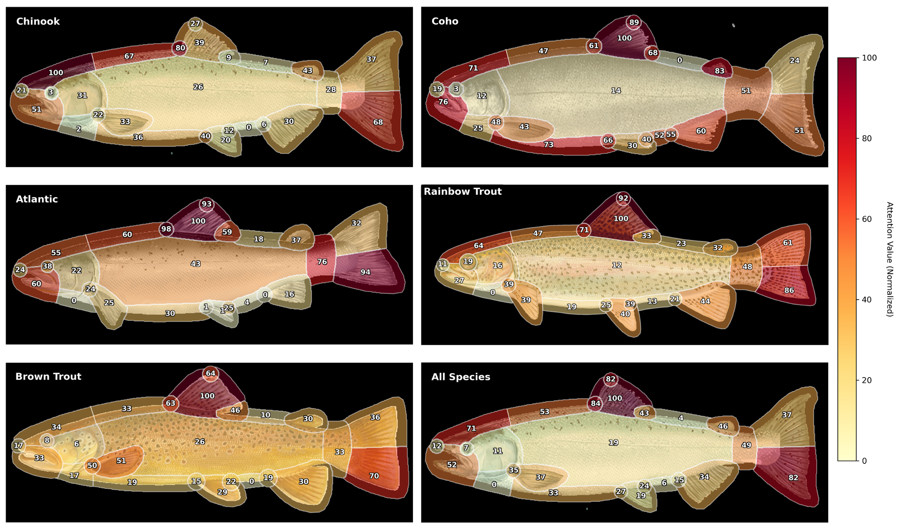
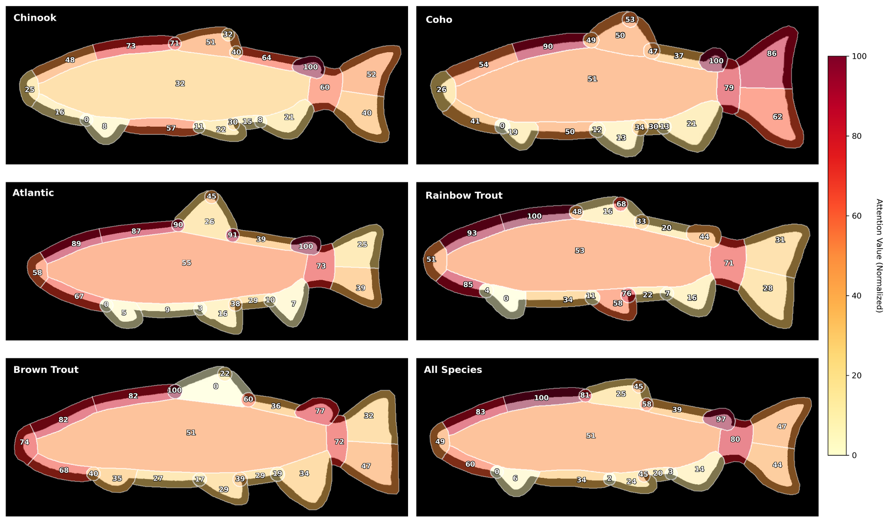

# fish-dvis

This repository contains code for my Master's thesis project used for training, evaluating, and analyzing how a deep learning model uses temporal and spatial information when classifying fish species from videos. The repository [LO_Fishway_Labelling](https://github.com/simonecollier/LO_Fishway_Labelling) contains the code and custom tools I developed for labelling the fish videos. This project uses the DVIS-DAQ model and builds upon the [DVIS_Plus](https://github.com/zhang-tao-whu/DVIS_Plus) repository.

## Project Overview

This project trains and evaluates a DVIS-DAQ–based video model to classify salmonid species from fishway videos, with a focus on understanding how temporal and spatial cues contribute to predictions. Experiments are run on two input variants: standard camera footage and transformed silhouette-only footage. In addition to performance evaluation, the repo includes scripts to analyze which frames are most informative for classification and to visualize spatial attention patterns.

<figure>
  
  <figcaption><em>Camera footage vs silhouette-only transformed footage used in this project.</em></figcaption>
</figure>

<figure>
  
  <figcaption><em>Example qualitative predictions: instance masks overlaid on video frames.</em></figcaption>
</figure>

<figure>
  
  <figcaption><em>Performance summary for camera and silhouette models.</em></figcaption>
</figure>

<figure>
  
  <figcaption><em>Plots showing frame importance distributions for the camera and silhouette model for two example videos.</em></figcaption>
</figure>

<figure>
  
  <figcaption><em>Example showing spatial attention overlaid on a video frame for each model.</em></figcaption>
</figure>

<figure>
  
  <figcaption><em>Aggregated spatial attention map for the camera model showing the average attention on each fish feature for each species.</em></figcaption>
</figure>

<figure>
  
  <figcaption><em>Aggregated spatial attention map for the silhouette model showing the average attention on each fish feature for each species.</em></figcaption>
</figure>

## Directory Structure

See READMEs in each subdirectory for more information on specific scripts. See [`WORKFLOW.md`](WORKFLOW.md) for details on the complete training, evaluation, and analysis process.

- **[`DVIS_Plus/`](DVIS_Plus/)**  
  Contains the original DVIS_Plus codebase.

- **[`data_scripts/`](data_scripts/)**  
  Scripts and utilities for preparing and processing the labeled fishway video dataset.

- **[`configs/`](configs/)**  
  Configuration files for training experiments.  

- **[`training_scripts/`](training_scripts/)**
  Contains scripts for training and evaluating the DVIS-DAQ model on the fishway dataset.

- **[`visualization_scripts/`](visualization_scripts/)**
  Contains scripts for visualizing model results and other miscellaneous visualizations.

- **[`temporal_analysis/`](temporal_analysis/)**
  Contains scripts for analyzing temporal information utilization of the model.

- **[`attention_analysis/`](attention_analysis/)**
  Contains scripts for extracting values from internal model components during inference and scripts for analyzing these results.

## Acknowledgements

- This project is based on [DVIS_Plus](https://github.com/zhang-tao-whu/DVIS_Plus) by Zhang Tao et al.
- Please refer to the DVIS_Plus repository for details on the underlying model and its original usage.
